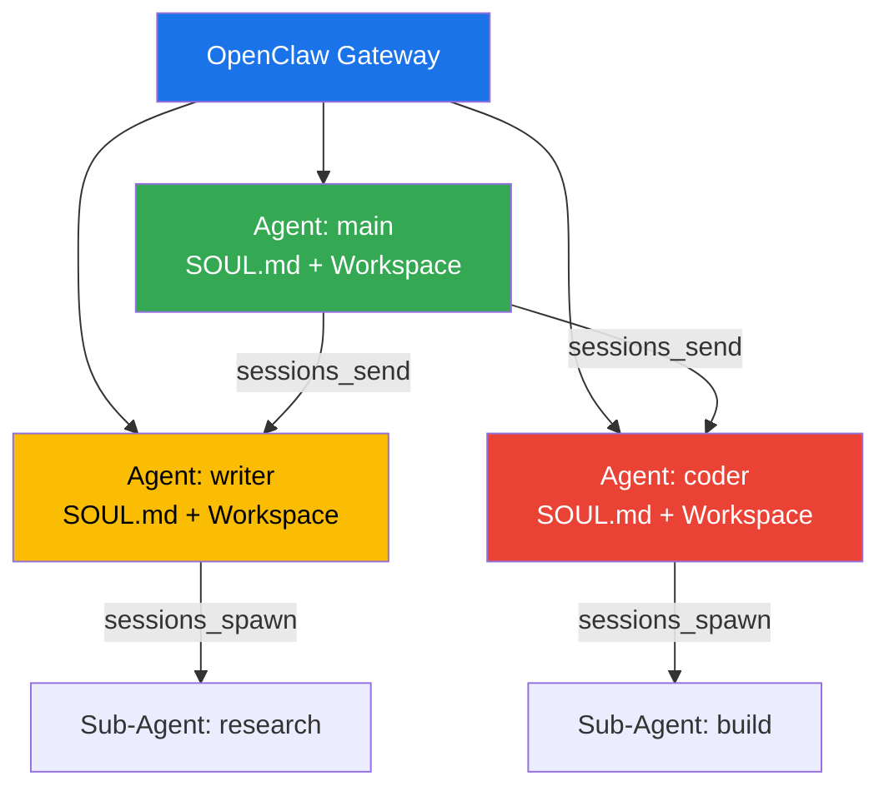

*OpenClaw 게이트웨이 하나에서 여러 에이전트가 각자의 역할을 수행한다*

## 왜 멀티 에이전트인가

단일 에이전트에는 세 가지 한계가 있다.

**첫째, 메모리 오염.** 한 에이전트가 코딩도 하고 글도 쓰고 리서치도 하다 보면, 벡터 스토어에 무관한 도메인이 뒤섞인다. 블로그 초안을 물어봤는데 지난주 디버깅 노트가 검색된다면? 그건 검색 알고리즘의 문제가 아니라 정보 밀도의 문제다.

> 💡 **핵심:** 도메인이 다르면 에이전트도 분리하라. 200MB가 넘는 메모리 인덱스에서 정밀도는 기하급수적으로 떨어진다.

**둘째, 페르소나 혼선.** 하나의 SOUL.md로 "격식 있는 기술 작가"와 "친근한 대화 상대"를 동시에 정의할 수 없다. 업무 채널에서 이모지가 난무하거나, 사적 대화에서 보고서 톤이 나온다.

**셋째, 모델 불일치.** 코딩엔 Claude Sonnet, 브레인스토밍엔 GLM-4.7, 라우팅 결정엔 Haiku만으로 충분하다. 하나의 모델을 모든 곳에 쓰면 단순 작업에 돈을 낭비하거나, 복잡 작업에서 성능이 부족하다.


*이종 모델 아키텍처는 단일 프리미엄 모델 대비 40~60% 비용 절감*

---

## OpenClaw에서 하나의 에이전트란

OpenClaw의 에이전트는 세 가지 완전 격리된 컴포넌트로 구성된다:

| 컴포넌트 | 경로 | 역할 |
|----------|------|------|
| **Workspace** | `~/.openclaw/workspace-<id>/` | SOUL.md, AGENTS.md, MEMORY.md 등 페르소나와 기억 |
| **Agent Dir** | `~/.openclaw/agents/<id>/agent/` | 인증 프로파일, 모델 레지스트리 |
| **Session Store** | `~/.openclaw/agents/<id>/sessions/` | 채팅 기록(JSONL), 라우팅 상태 |

> ⚠️ **교훈:** 두 에이전트가 agentDir을 공유하면 인증 충돌, 세션 누수, 메모리 오염이 발생한다. 절대 하지 마라.

### 에이전트 생성

```bash
# CLI로 에이전트 추가
openclaw agents add writer
openclaw agents add coder
openclaw agents add researcher

# 바인딩 확인
openclaw agents list --bindings
```

각 에이전트는 자신만의 `SOUL.md`로 성격을 정의하고, 독립된 모델을 할당받을 수 있다.

---

## 라우팅: 누가 어떤 메시지를 받는가

OpenClaw의 바인딩(Binding)은 **결정론적**이다. LLM이 판단하는 게 아니라, 규칙이 매칭한다. 토큰 비용 = 0.

### 8단계 우선순위


| 우선순위 | 매칭 조건 | 전형적 용도 |
|----------|-----------|-------------|
| 1 | 정확한 peer (DM/그룹 ID) | 특정 채팅 → 특정 에이전트 |
| 2 | 부모 peer (스레드 상속) | 포럼 스레드 |
| 3 | Guild ID + 역할 | Discord 역할 기반 |
| 4 | Guild ID | Discord 서버 전체 |
| 5 | Team ID | Slack 워크스페이스 |
| 6 | Account ID | 같은 채널, 다른 계정 |
| 7 | 채널 수준 기본값 | 채널 타입 전체 |
| 8 | 폴백 기본값 | `default: true` 에이전트 |

### 설정 예시

```json5
{
  agents: {
    list: [
      { id: "main", workspace: "~/.openclaw/workspace-main", default: true },
      { id: "writer", workspace: "~/.openclaw/workspace-writer" },
      { id: "coder", workspace: "~/.openclaw/workspace-coder" },
    ],
  },
  bindings: [
    // 특정 그룹 → 특정 에이전트
    { agentId: "writer", match: { channel: "telegram", peer: { kind: "group", id: "-100xxx" } } },
    // 채널 수준 기본값
    { agentId: "main", match: { channel: "telegram" } },
  ],
}
```

> 💡 **핵심:** 정적 라우팅은 LLM 호출 없이 즉시 결정된다. 동적 라우팅은 sessions_send로만 사용하라.

---

## 에이전트 간 통신: 두 가지 메커니즘

이게 핵심이다. OpenClaw는 에이전트 간 통신을 위해 두 가지 도구를 제공한다.

### 1) sessions_spawn — 하청 업체 패턴


메인 에이전트가 서브 에이전트를 파견해 특정 작업을 수행하고, 완료되면 결과가 자동 보고된다.

```javascript
// 비블로킹: 즉시 반환, 백그라운드에서 실행
sessions_spawn({
  task: "AI 트렌드 조사해서 3페이지 요약본 작성",
  label: "research-task",
  runTimeoutSeconds: 300
})
// 반환: { status: "accepted", runId, childSessionKey }
```

**특징:**
- 비블로킹 — 호출 즉시 반환
- 격리된 환경 — 자체 컨텍스트 윈도우와 도구 권한
- 인라인 파일 첨부 지원 (v2026.3.2+)
- 중첩 깊이 1~5레벨 확장

**v2026.3.2 인라인 첨부:**
```javascript
sessions_spawn({
  task: "이 문서들을 분석해줘",
  attachments: [{
    name: "report.pdf",
    content: base64EncodedContent,
    encoding: "base64",
    mimeType: "application/pdf"
  }]
})
```

### 2) sessions_send — 동료 간 메신저


두 독립 에이전트가 직접 대화한다. 질문-답변, 협상, 여러 라운드의 교환 모두 가능.

```javascript
// 동기 호출 (응답 대기)
const result = sessions_send({
  sessionKey: "agent:researcher:main",
  message: "AI 트렌드 조사 시작해줘",
  timeoutSeconds: 30
})
// 반환: { runId, status: "ok", reply: "조사 시작했습니다..." }

// 비동기 호출 (fire-and-forget)
sessions_send({
  sessionKey: "agent:researcher:main",
  message: "긴급: 서버 점검 필요",
  timeoutSeconds: 0
})
```

**ping-pong 교환** — 양측이 여러 라운드를 주고받을 수 있다 (최대 5라운드, 설정 가능):

```json5
{
  session: {
    agentToAgent: {
      maxPingPongTurns: 3, // 0~5, 기본값 5
      enabled: true,
      allow: ["main", "researcher", "coder"]
    }
  }
}
```

> 💡 **핵심:** sessions_send는 기본적으로 비활성화되어 있다. `agentToAgent.enabled: true`와 `allow` 목록을 명시적으로 설정해야 한다.

### 둘의 차이


| | sessions_spawn | sessions_send |
|--|----------------|---------------|
| 관계 | 부모-자식 | 피어-투-피어 |
| 통신 방식 | 일방 결과 통지 | 양방향 대화 |
| 세션 키 안정성 | UUID 기반 (재시작 시 소실) | 안정적 (게이트웨이 재시작 후에도 복구 가능) |
| 중첩 깊이 | 제한됨 (maxSpawnDepth 1~5) | 제한 없음 |
| 파일 첨부 | ✅ 지원 | ❌ 불가 |
| 핑퐁 교환 | ❌ | ✅ (0~5 라운드) |

**선택 기준:**
- 작업이 명확하고 끝나면 끝 → `sessions_spawn`
- 여러 라운드의 협상이 필요 → `sessions_send`
- 게이트웨이 재시작 후에도 세션 복구가 필요 → `sessions_send`
- 로컬 파일을 넘겨야 함 → `sessions_spawn`

---

## 세 가지 실전 아키텍처 패턴

### 패턴 1: 오케스트레이터 (가장 일반적)

```
Main Agent (depth 0)
 └── Orchestrator Sub-Agent (depth 1)
     ├── Worker A (depth 2) — 조사
     ├── Worker B (depth 2) — 작성
     └── Worker C (depth 2) — 검토
```

명확하고 독립적인 작업에 적합. 단점은 LLM이 언제 spawn할지 결정하므로 실행 순서가 비결정적이다.

> 📌 **응용:** 블로그 포스트 생산 파이프라인 — 조사, 초안 작성, 편집을 각각 워커에게 위임.

### 패턴 2: 전문가 네트워크 (복잡한 협업)

```
Main Agent
 ├─ sessions_send → Researcher (상주 에이전트)
 │   └─ sessions_spawn → sub-agent (웹 검색)
 └─ sessions_send → Writer (상주 에이전트)
     └─ sessions_spawn → sub-agent (초안 작성)
```

메인 에이전트가 sessions_send로 상주 전문가에게 요청하고, 각 전문가가 다시 sessions_spawn으로 하위 작업을 위임한다. 깊이 제한을 우회할 수 있지만 설정 복잡도가 올라간다.

> 📌 **응용:** 연구 보고서 작성 — 리서처가 데이터를 수집하고, 라이터가 초안을 작성하며, 메인이 최종 편집.

### 패턴 3: Lobster 결정론적 파이프라인


LLM이 오케스트레이션하면 반복 카운트 오류, 단계 건너뛰기, 무한 루프가 발생할 수 있다. YAML 파일은 이런 실수를 하지 않는다.

> 💡 **교훈:** "코드 → 리뷰 → 테스트 → 배포" 같은 엄격한 파이프라인이 필요하면 Lobster를 사용하라. LLM이 흐름을 제어하게 두지 마라.

```yaml
# Lobster 워크플로우 예시
name: blog-pipeline
steps:
  - id: research
    pipeline: "openclaw.invoke --tool llm-task --action json ..."
  - id: write
    pipeline: "openclaw.invoke --tool llm-task --action json ..."
  - id: review
    approval: true  # 여기서 멈추고 승인 대기
  - id: publish
    pipeline: "openclaw.invoke --tool exec ..."
```

---

## 세션 가시성과 보안

에이전트가 다른 에이전트의 세션을 볼 수 있는 범위를 4단계로 제어할 수 있다:

| 레벨 | 범위 |
|------|------|
| `self` | 현재 세션만 |
| `tree` (기본값) | 현재 + 스폰된 서브 에이전트 |
| `agent` | 같은 에이전트의 모든 세션 |
| `all` | 모든 세션 (크로스 에이전트, 설정 필요) |

샌드박스 세션은 설정과 무관하게 `tree`로 고정된다.

> ⚠️ **교훈:** 최소 권한 원칙을 적용하라. 가족용 에이전트는 `read`만 허용하고 `exec`, `write`, `edit`를 거부하는 식으로.

---

## 실전 비용 최적화

| 에이전트 계층 | 추천 모델 | 이유 |
|---------------|-----------|------|
| 메인 오케스트레이터 | Claude Opus / Sonnet | 복잡한 조정 로직 |
| 오케스트레이터 서브 | GPT-5.4-mini | 작업 분배만 하므로 |
| 워커 서브 | GPT-5.4-nano | 단순 실행, 심화 사고 불필요 |
| 수퍼바이저 | Claude Haiku | 라우팅만 하므로 가장 저렴 |

> 💡 **핵심:** 수퍼바이저에 가장 적게 돈을 써라. 그 일은 "어떤 에이전트가 이 메시지를 처리할까?"뿐이다. Haiku로 충분하다.

---

## 우리 연구소에서의 적용

빅터스 연구소도 이 구조를 따를 수 있다:

- **헥스** — 메인 오케스트레이터. 조정과 전략 결정.
- **빅터스** — 작업 실행자. 블로그 작성, 코드 개발, 리서치.
- 필요시 sessions_spawn으로 임시 서브 에이전트를 파견해 병렬 작업 수행.

텔레그램에서 "빅터스야 이거 해줘"라고 하면, 해당 메시지는 바인딩을 통해 빅터스에게 라우팅된다. "헥스야 조사해줘"는 헥스에게. 한 게이트웨이, 여러 뇌, 각자의 기억.

---

## 결론

멀티 에이전트 협업의 핵심은 **정적 라우팅으로 흐름을 고정하고, sessions_send로 필요할 때만 동적 의사결정을 허용하는 것**이다. LLM이 전체 오케스트레이션을 담당하게 두면 비용이 폭증하고 제어가 불가능해진다 — 규칙이 흐름을 잡고, LLM이 창의성을 담당하게 하라.

---

*관련 문서:*
- *[OpenClaw Multi-Agent Routing 공식 문서](https://docs.openclaw.ai/concepts/multi-agent)*
- *[Session Tools 문서](https://docs.openclaw.ai/concepts/session-tool)*
- *[OpenClaw Multi-Agent Setup Guide (heyuan110)](https://www.heyuan110.com/posts/ai/2026-04-02-openclaw-multi-agent-setup-guide/)*
- *[Multi-Agent Deep Dive v2 (frank.hk)](https://www.frank.hk/en/posts/2026/openclaw-multi-agent-workflow-v2/)*
- *[Lobster Workflow Engine](https://github.com/openclaw/lobster)*
