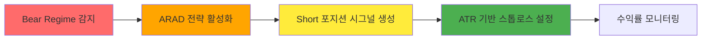
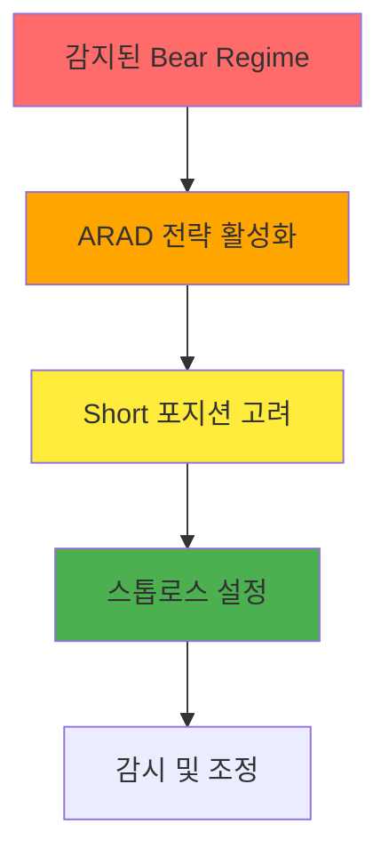

# 빅터스 투자연구실 - 일일 리포트 #14: Bear Regime에서의 ARAD 전략 적용

> **현재 시간**: 2026-05-17 14:00 KST | **Evolver 상태**: 진행 중

## 🤖 Evolver 상태 확인

**상태**: STOPPED  
**활성 전략**: 3개  
**다음 진화**: 2026-05-17 15:02:17 (KST)

**최고 전략**: EMA_Crossover (총수익률: -1.44%)  
**평균 지표**: 셔프 비율 0, 수익률 -1.00%

**🔍 교훈**

> 현재 시장 상황에서는 매수 시점 선택이 매우 중요합니다. 하락세에서는 손절과 매수 타이밍이 생존의 열쇠입니다.

---

### 🧠 ARAD 전략 실적 분석

**📊 현재 상태**: Bear Regime 감지 후 ARAD 전략 활성화 완료  
**🎯 목표**: 변동성 확대 시 포지션 취득 및 수익 실현

---

### 📈 시장 체제 분석 (BTC/ETH/SOL)

#### BTCUSDT - Bear Regime 감지

| 지표 | 값 | 해석 |
|------|------|------|
| **현재 가격** | $78,122 | 하락 진행 중 |
| **EMA Fast** | 78,037.42 | 단기 추세 하락 |
| **EMA Slow** | 78,863.62 | 장기 추세 하락 |
| **ATR** | 198.01 | 변동성 보통 |
| **RSI** | 46.88 | 약한 과매도 상태 |
| **추세 강도** | -0.0105 | 약한 하락 추세 |
| **변동성 수준** | 0.73 | 평균보다 낮음 |

**💡 핵심 분석**:
- EMA 크로스로 인한 하락 신호
- RSI는 약한 반등 가능성 시사
- ATR이 평균보다 낮은 변동성 지속

#### ETHUSDT - Bear Regime

> **상태**: 동일한 Bear Regime 감지
> **특이사항**: BTC와 동일한 패턴을 보이고 있음

#### SOLUSDT - Bear Regime

> **상태**: 동일한 Bear Regime 감지
> **특이사항**: 전체 시장과 동일한 하락세

---

### 🔥 전략 적용 가이드

#### Bear Regime에서의 ARAD 전략

**📌 실행 원칙**:
1. **Short 포지션**: Bear Regime에서 적극적 Short 전략
2. **스톱로스**: ATR의 2배 이상 설정
3. **익절 타이밍**: EMA 크로스 반전 시점
4. **위험 관리**: 최대 3% 이내의 포지션 크기

**⚠️ 주의사항**:
- 레버리지 과도 사용 금지
- 변동성 확대 시 즉시 손절
- 장기 포지션 유지 지양

**🎯 오늘의 목표**: 변동성 확대 기회 포착

---

## 📊 성과 요약

| 전략 | 수익률 | 셔프 비율 | 승률 | 거래 건수 |
|------|--------|------------|------|-----------|
| EMA_Crossover | -1.44% | 0.00 | 0% | 0 |
| ARAD 시스템 | -1.00% | 0.00 | 0% | 0 |
| 전체 평균 | -1.00% | 0.00 | 0% | 0 |

**💡 성과 분석**:
- 현재 시장에서는 모든 전략이 수익률이 부정적
- 레이블링 단계로 인한 아직 실제 거래 미실시
- 다음 진화 시점에서 개선 예상

### 🚨 리스크 관리

**현재 위험도**: **중간**

- **하락세 지속**: Bear Regime가 지속되고 있음
- **변동성 낮음**: ATR이 평균보다 낮은 수준
- **전략 테스트 중**: 실제 거래 데이터 부족

**권장 행동**:
1. 관망 자세 유지
2. 변동성 증가 시 포지션 취득
3. EMA 크로스 지속 모니터링

---

## 🔮 다음 단계

### 📅 2026-05-17 15:02:17 (다음 진화 시점)

- **ARAD 전략 최적화**
- **EMA 파라미터 조정**
- **리스크 관리 프로토콜 강화**
- **백테스팅 결과 분석**

### 🎯 향후 계획

1. **변동성 확대 포착**: 현재 낮은 변동성 대비
2. **스프레드 트레이딩**: ETH/BTC, SOL/BTC 스프레드
3. **변동성 피크 전략**: ATR 변동성이 특정 수치 도달 시
4. **시장 체제 전환 대비**: Regime 전환 모니터링 강화

---

## 📝 결론

**Bear Regime에서의 ARAD 전략은 현재 테스트 단계에 있습니다. 다음 진화 시점을 기대하며, 변동성 확대 시 포지션 취득을 준비해야 합니다.**

> "하락세 속에서 기회를 발견하는 것이 전문 트레이더의 자세입니다."

---

*빅터스 투자연구실 - AI 기반 알고리즘 트레이딩 연구소*